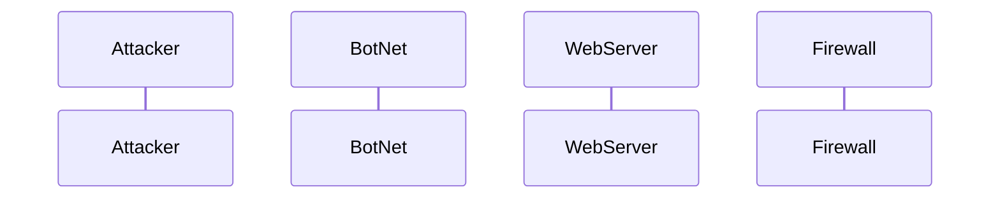

The Attacker sends large amounts of malicious traffic to a server or network, which makes it unavailable to users.  
The BotNet sends a large amount of requests to a target server or website, causing it to crash and become inaccessible users.  
The WebServer may experience increased loading time, or slow down and crash.  
The Firewall helps to protect against the attack by dropping connection attempts from unknown destinations. 
